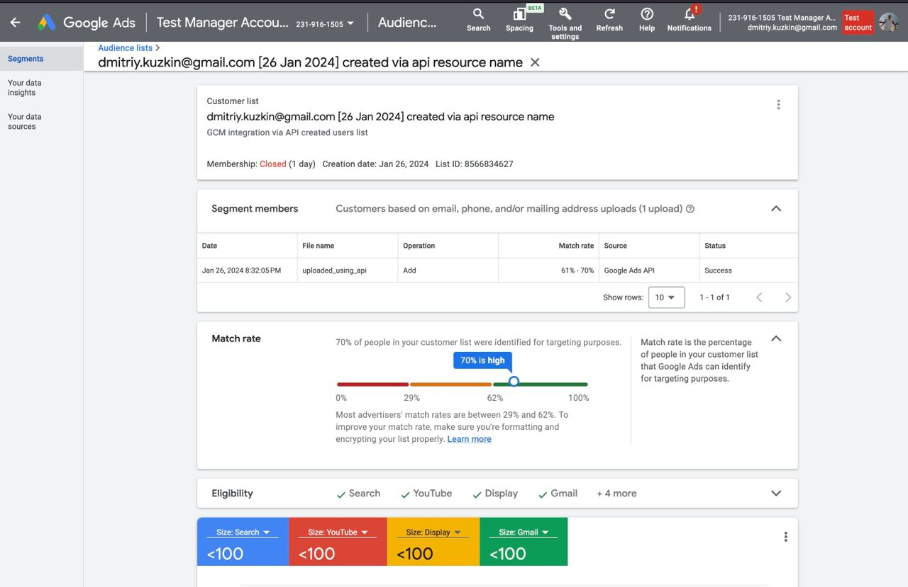

### Minimal prototype to create audience in Google Customer Match

#### Docs
[Google OAuth2](https://developers.google.com/identity/protocols/oauth2)

#### Project api flow
1 OAuth flow 
- Make oauth attempt request
- navigate to redirect url(property of oauth attempt response)
- copy authorization code from google auth page 
- Make complete oauth attempt request with passing oauth attempt id and authorization code
2 Create audience

